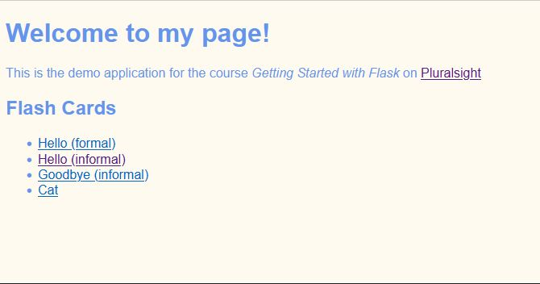
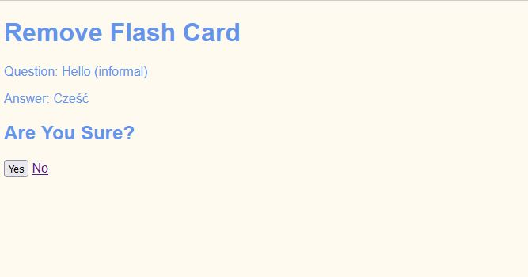

# Learning Flask - Flashcards

Basic flashcards app created using Flask.

Start page:



Viewing flashcard:


Removing flashcard:



## Setup

To create virtual environment run:

_Linux_

```bash
python -m venv .venv
./.venv/Scripts/activate
```

_Windows_

```cmd
python -m venv .venv
.\.venv\Scripts\activate
```

To save requirements run:

```bash
pip freeze > requirements.txt
```

To install requirements run:

```bash
pip install -r requirements.txt
```

If you want to upgrade all packages to the latest version run:

```bash
pip install -r requirements.txt --upgrade
```

To start Flask application do this:

_Linux_

```bash
export FLASK_APP=flashcards.py
export FLASK_ENV=development
flask run
```

_Windows_ (Command Line)

```cmd
set FLASK_APP=flashcards.py
set FLASK_ENV=development
flask run
```

_Windows_ (PowerShell)

```cmd
$Env:FLASK_APP='flashcards.py'
$Env:FLASK_ENV='development'
flask run
```

If you don't want to use `flask run` you can use `python flashcards.py` instead.

One word about database (aka "flashcards_db.json"), provided that you don't want to commit changes to it.

You can use `git update-index --assume-unchanged flashcards_db.json` to tell git to ignore changes to this file.

## Learning Resources

This app is based on:

- _[Flask: Getting Started](https://app.pluralsight.com/library/courses/flask-getting-started/table-of-contents)_ [:file_folder:](https://app.pluralsight.com/library/courses/flask-getting-started/exercise-files).
