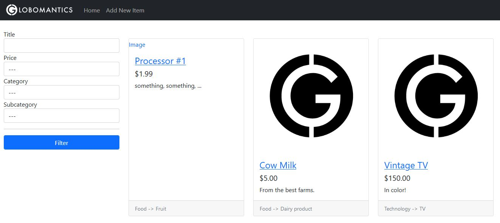
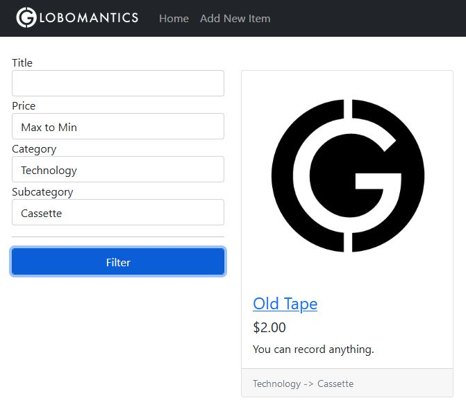
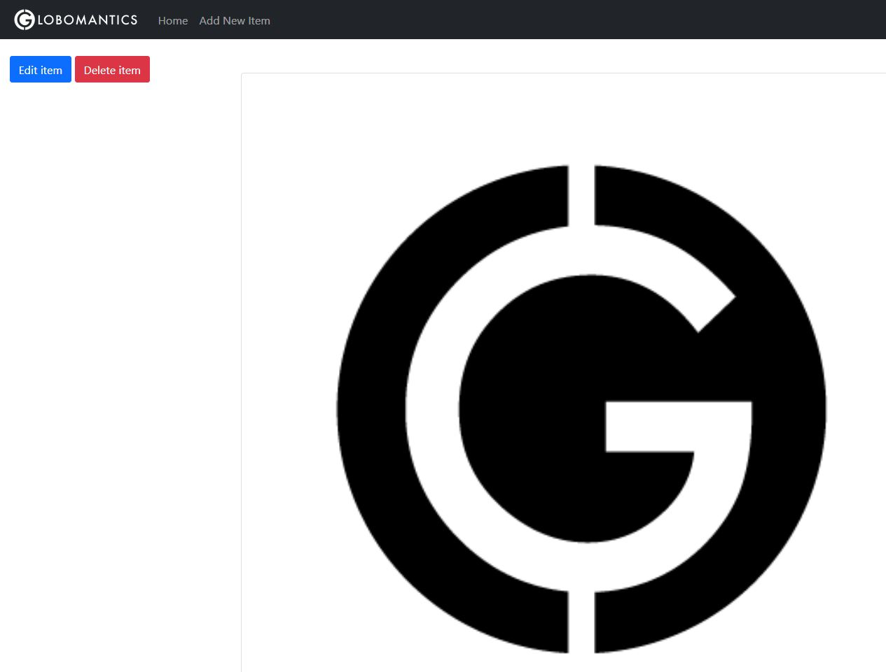
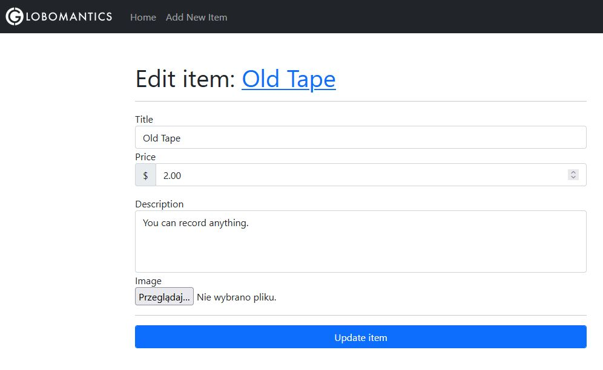
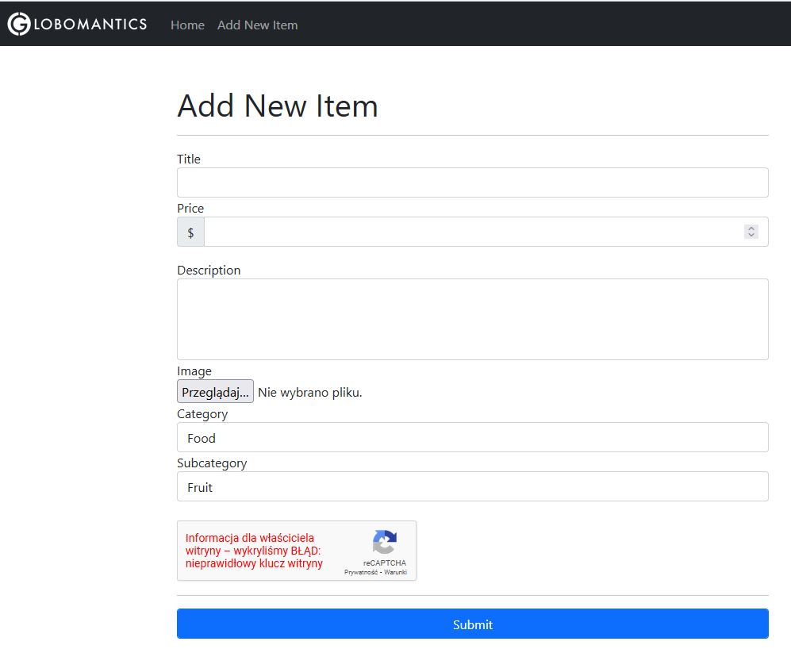
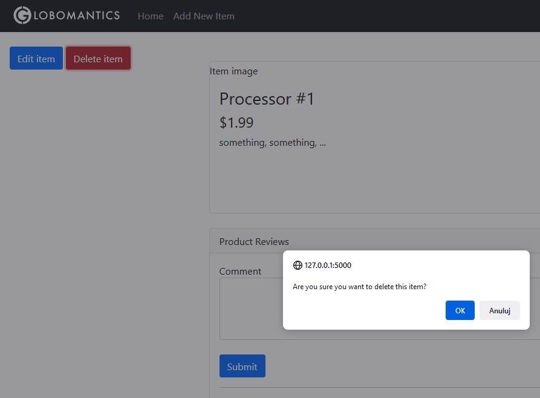

# Learning Flask - Web Forms

Basic app demonstrating web forms created using Flask.

Start page:



Filtering items:



View single item:



Editing item:



Adding new item:



Removing item:



## Setup

To create virtual environment run:

_Linux_

```bash
python -m venv .venv
./.venv/Scripts/activate
```

_Windows_

```cmd
python -m venv .venv
.\.venv\Scripts\activate
```

To save requirements run:

```bash
pip freeze > requirements.txt
```

To install requirements run:

```bash
pip install -r requirements.txt
```

If you want to upgrade all packages to the latest version run:

```bash
pip install -r requirements.txt --upgrade
```

To start Flask application do this:

_Linux_

```bash
export FLASK_APP=app.py
export FLASK_ENV=development
flask run
```

_Windows_ (Command Line)

```cmd
set FLASK_APP=app.py
set FLASK_ENV=development
flask run
```

_Windows_ (PowerShell)

```cmd
$Env:FLASK_APP='app.py'
$Env:FLASK_ENV='development'
flask run
```

## Learning Resources

This app is based on:

- _[Creating and Processing Web Forms with Flask](https://app.pluralsight.com/library/courses/creating-processing-web-forms-flask/table-of-contents)_ [:file_folder:](https://app.pluralsight.com/library/courses/creating-processing-web-forms-flask/exercise-files).
